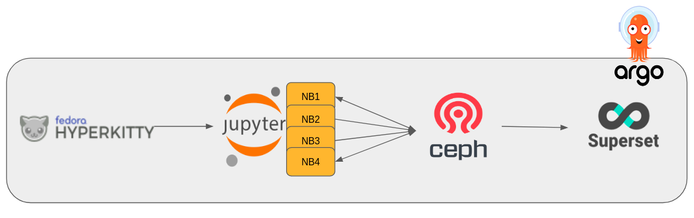
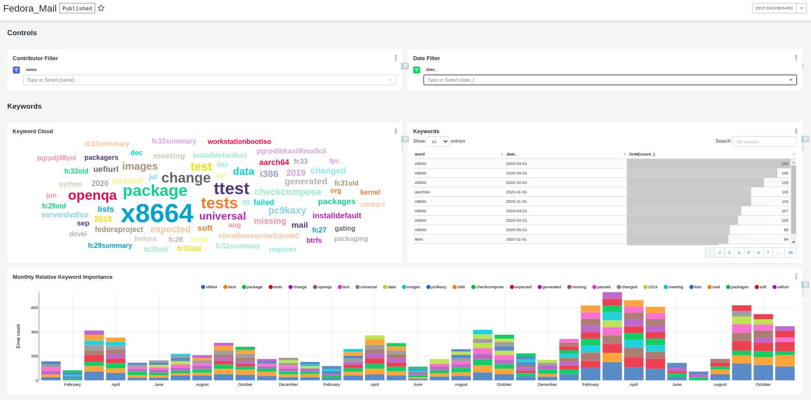

# Mailing List Analysis Toolkit

This repository contains example code for how to develop a custom end-to-end email analytics service using the Open Data Hub on OpenShift. Although the specific example here is a mailing list analysis tool, our hope is to show that this approach could be easily modified and adapted to many intelligent application use cases.

#
## Project Assumptions
This repository assumes that you have an existing Open Data Hub deployed on OpenShift that includes, JupyterHub, Argo, Ceph, Hive, Cloudera Hue and Apache Superset.

* Take a look at [opendatahub.io](https://www.opendatahub.io) for details on the open data hub platform.
* Details of our existing public deployment can be found at [operate-first.cloud](https://www.operate-first.cloud/).

#
## Project Overview
The purpose of this project is to develop and maintain an open source NLP application that provides regular and up-to-date analytics for large open source development project  mailing lists.

### **Current Lists/ Datasets**
* [Fedora Devel](https://lists.fedoraproject.org/archives/list/devel@lists.fedoraproject.org/)
* ? (please open an issue if you'd like another mailing list included)

### **Application Overview**

At a high level, this application can be seen as an [Argo Workflow](https://argoproj.github.io/argo/) which orchestrates a set of Jupyter notebooks to push transformed data to Ceph. Each notebook is responsible for a single task and is used either for collecting raw data from the [Fedora HyperKitty mailing list archive](https://lists.fedoraproject.org/archives/) (our live data set), preprocessing that data, or performing some specific analytics task. In almost all cases, the notebooks both push their outputs to Ceph remote storage (for use in a future run) as well as maintain a local copy within a shared volume among the application's pods for use by other notebook processes. Finally we use external tables in Apache Hive, with Hue, to connect the Ceph data to a SQL database for interactive visualization with Superset.

### **User Interaction**

The primary output and user interface for this application is a [Superset](https://superset.apache.org/) dashboard. This tool allows us to define certain data visualization elements from our analysis that we would like to publish and share with others, while also including enough flexibility and interactivity to allow users to explore the data themselves.

Our application is designed to automatically re-run the analyses on regular basis and ensure that the dashboard and all its plots are current and up to date.

* Current [Superset Dashboard](https://superset.datahub.redhat.com/superset/dashboard/fedora_mail/) can be found here.

### **Notebook Architecture**

Currently notebooks are divided into two sub-directories `notebooks/01_collect_data` and `notebooks/02_analyses` depending on what stage in the argo workflow they belong to. This should make it explicit where notebooks go in the argo workflow dependency tree when defining it in the `wftmpl.yaml` manifest file. Ideally, the notebooks in `notebooks/01_collect_data` should not be dependent on each other (they could be run in parallel) and notebooks in `notebooks/02_analyses` should be independent of each other and only depend on the output of notebooks in `notebooks/01_collect_date`. That way we keep the workflow and dependency structure clear during development and we believe this architecture can be easily modified to accommodate more complex dependency requirements.

**Current Notebooks**:

* 01_collect_data

    * collect_data (Download new data from source and push to remote storage)
    * download_dataset (Download existing preprocessed data from remote storage)
    * gz_to_raw (Convert downloaded *.gz files to raw mbox format)
    * raw_to_meta (Process mbox files into monthly metadata *.csv and push to remote storage)
    * raw_to_text(Process mbox files into monthly email body *.csv and push to remote storage)
    * ? (please open an issue if you would like an additional data collection or pre processing step added)

 * 02_analyses

    * contributor_analysis (Quantify users monthly activity and push to remote storage)
    * keyword_analysis (Identify top Keywords for each month and push to remote storage)
    * ? (please open an issue if you would like an additional analysis added)

**Adding Notebooks**

One of the key benefits of this approach is that it allows for the bulk of the development to be done directly in a jupyter notebook as well as making adding new analyses or preprocessing steps as simple adding a new notebook to the repository. For example, in order to add an additional analysis to the application one just needs to make submit a PR with a new notebook in `notebooks/02_analyses` and a small update to `manifest/wftmpl.yaml` to include the new notebook into the workflow.

### Automation and Workflow Configurations

Please see the README at [manifests/README.md](manifests/README.md) for complete details on how to define the automation and application workflow via Argo.
